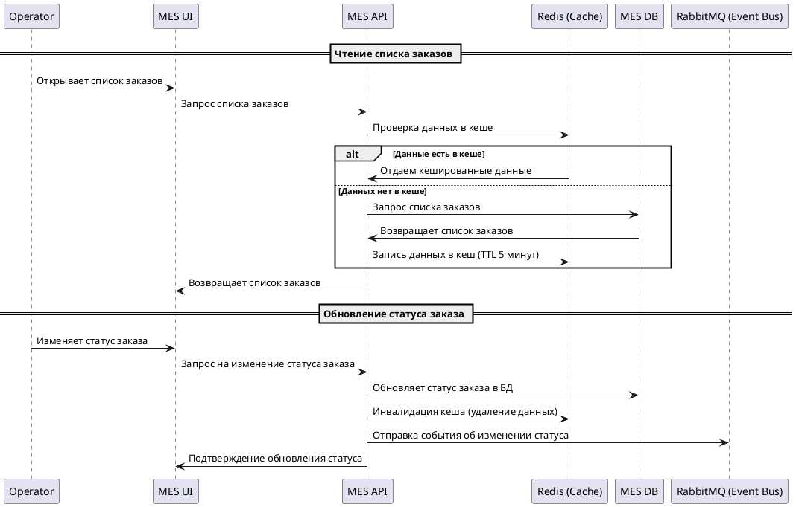
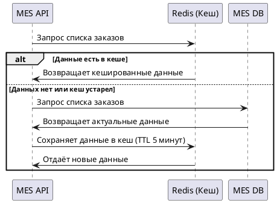
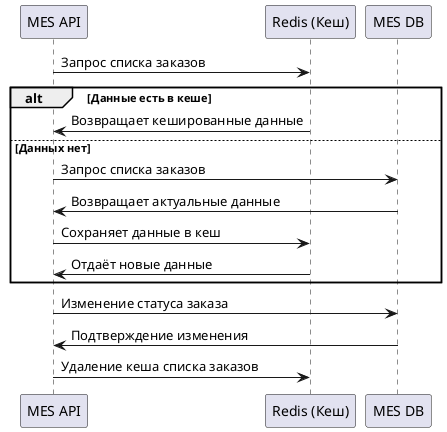

# 1. Анализ системы и целевые области кеширования

Система **Jewerly Store System** включает в себя несколько ключевых компонентов, обрабатывающих заказы:

- **Shop API** (обработка заказов, работа с 3D-файлами)
- **CRM API** (работа с клиентами и сделками)
- **MES API** (основная бизнес-логика исполнения заказов, расчет стоимости)
- **RabbitMQ (Queue)** (очереди сообщений для обработки заказов)
- **Базы данных** (Shop DB, MES DB)

## Выявленные узкие места по производительности
1. **MES API → MES DB**
    * Проблема: высокие нагрузки на БД при частых запросах от операторов.
    * Решение: кеширование списка заказов и их статусов, чтобы снизить нагрузку на БД.

2. **Shop API → Shop DB**
    * Проблема: частые запросы к каталогу товаров, который обновляется редко.
    * Решение: кеширование списка товаров на уровне API.

3. **MES API → Расчет стоимости заказа**
    * Проблема: повторяющиеся запросы к модулю расчета стоимости.
    * Решение: кеширование результатов расчета стоимости заказов.

4. **Shop API → S3 (3D-файлы)**
    * Проблема: загрузка одних и тех же 3D-файлов при каждом обращении.
    * Решение: кеширование метаданных 3D-файлов для ускорения доступа.

5. **Очередь сообщений (RabbitMQ)**
    * Проблема: возможные дублирующиеся запросы при повторной обработке сообщений.
    * Решение: кеширование обработанных сообщений для предотвращения дублирования.

## Выбор компонентов для кеширования в первую очередь
Приоритетное кеширование необходимо для **MES API** и **Shop API**, так как:
- Они критичны для работы операторов и заказчиков.
- Имеют частые повторяющиеся запросы.
- Высокая нагрузка на базы данных.

Следующими этапами можно внедрять кеширование для **S3** и **RabbitMQ**.

# 2. Мотивация

## 2.1. Проблемы, требующие решения
В текущем состоянии система **MES** испытывает серьезные проблемы с производительностью, что негативно сказывается на скорости работы операторов и удовлетворенности клиентов. Основные выявленные проблемы:

1. **Долгое открытие списка заказов** в **MES API** из-за высокой нагрузки на базу данных (**MES DB**).
2. **Замедленный расчет стоимости заказа**, так как каждый запрос требует повторных вычислений.
3. **Высокая нагрузка на Shop API** при загрузке каталога товаров, несмотря на то, что данные обновляются редко.
4. **Медленный доступ к 3D-файлам в S3**, так как при каждом обращении требуется загрузка и обработка метаданных.
5. **Возможное дублирование сообщений в RabbitMQ**, что ведет к избыточной обработке заказов.

## 2.2. Решение через кеширование
Внедрение механизма кеширования позволит:
- **Снизить нагрузку на базы данных** путем хранения часто запрашиваемых данных в быстром хранилище.
- **Ускорить загрузку интерфейсов для операторов**, особенно списков заказов и их статусов.
- **Уменьшить время расчета стоимости заказов**, кешируя результаты предыдущих вычислений.
- **Оптимизировать работу с 3D-файлами**, кешируя метаданные, чтобы ускорить их обработку.
- **Повысить надежность работы с очередями сообщений**, предотвращая повторную обработку заказов.

## 2.3. Элементы системы, подлежащие кешированию
В первую очередь кешированию подлежат следующие компоненты системы:

1. **MES API → MES DB** – кеширование списка заказов и их статусов для ускорения работы операторов.
2. **Shop API → Shop DB** – кеширование каталога товаров, так как он изменяется редко.
3. **MES API → Расчет стоимости** – кеширование результатов расчета стоимости заказов.
4. **Shop API → S3 (3D-файлы)** – кеширование метаданных 3D-файлов для быстрого доступа.
5. **RabbitMQ** – кеширование обработанных сообщений для предотвращения дублирования.

# 3. Предлагаемое решение»

## 3.1. Выбор типа кеширования: клиентское или серверное
В нашем случае основная проблема связана с высокой нагрузкой на серверную часть (**MES API, Shop API**) и базу данных (**MES DB, Shop DB**). Операторы часто запрашивают одни и те же данные (например, список заказов), что создает дополнительную нагрузку. Поэтому мы **сконцентрируемся на серверном кешировании**, так как оно позволяет:

- **Сократить нагрузку на базы данных** за счет хранения часто запрашиваемых данных в более быстром хранилище (Redis, Memcached).
- **Ускорить работу API** за счет хранения результатов вычислений и предотвращения повторных запросов.
- **Обеспечить согласованность данных** за счет централизованного управления кешем.

Клиентское кеширование (например, кеширование в браузере или локальном хранилище) может использоваться для статических ресурсов (CSS, изображения, 3D-модели), но оно не решает основные проблемы производительности API.

## 3.2. Выбор паттерна кеширования
Для разных компонентов системы будут применены разные паттерны кеширования, исходя из их характеристик.

1. **MES API → MES DB (Список заказов, статусы заказов) → Cache-Aside**
    - **Почему Cache-Aside?**
        - Операторы часто запрашивают список заказов, но данные могут изменяться.
        - Данные не должны устаревать автоматически, а обновляться по мере запроса.
        - Если в кеше нет данных, API получит их из БД, а затем добавит в кеш.
    - **Почему не Write-Through?**
        - Внесение заказов в базу происходит реже, чем их чтение, поэтому обновление кеша на запись нецелесообразно.
    - **Почему не Refresh-Ahead?**
        - Необходимость обновления данных заранее непредсказуема, поэтому проактивное обновление неэффективно.

2. **Shop API → Shop DB (Каталог товаров) → Write-Through**
    - **Почему Write-Through?**
        - Каталог товаров обновляется редко, а запрашивается часто.
        - Каждое обновление каталога сразу записывается в кеш, чтобы данные всегда были актуальными.
    - **Почему не Cache-Aside?**
        - В случае сброса кеша придется заново запрашивать все товары, что создаст лишнюю нагрузку.
    - **Почему не Refresh-Ahead?**
        - Нет необходимости в автоматическом обновлении, так как изменения каталога контролируемые.

3. **MES API (Расчет стоимости заказа) → Refresh-Ahead**
    - **Почему Refresh-Ahead?**
        - Стоимость заказа рассчитывается часто, а формула расчета редко меняется.
        - Можно предсказать, какие заказы будут пересчитываться чаще всего, и обновлять их кеш заранее.
    - **Почему не Cache-Aside?**
        - Время первого запроса все равно будет большим, так как кеш обновляется только при запросе.
    - **Почему не Write-Through?**
        - Кеш обновлять при каждом изменении данных неэффективно, так как заказы обновляются не так часто.

4. **Shop API → S3 (3D-файлы, метаданные) → Cache-Aside**
    - **Почему Cache-Aside?**
        - Метаданные файлов запрашиваются часто, но изменяются редко.
        - Если данных нет в кеше, они загружаются из S3 и сохраняются в кеш.
    - **Почему не Write-Through?**
        - Данные загружаются редко, поэтому нет смысла обновлять кеш при каждой загрузке.
    - **Почему не Refresh-Ahead?**
        - Автоматическое обновление кеша не нужно, так как новые файлы появляются нерегулярно.

5. **RabbitMQ (Фильтрация дублирующихся сообщений) → Write-Through**
    - **Почему Write-Through?**
        - Каждое сообщение записывается в кеш сразу при обработке, чтобы избежать дублирования.
    - **Почему не Cache-Aside?**
        - Ожидание загрузки сообщения из БД перед кэшированием может привести к дублированию.
    - **Почему не Refresh-Ahead?**
        - Сообщения появляются нерегулярно, поэтому предзагрузка бессмысленна.

## 3.3. Выбранные технологии
- **Redis** – для быстрого кеширования данных, где важна низкая задержка (заказы, каталоги, расчет стоимости).
- **Memcached** – для простого кеширования метаданных 3D-файлов.
- **Bloom-фильтр в Redis** – для предотвращения дублирования сообщений в RabbitMQ.

## 3.4. Описание процесса кеширования при чтении списка заказов и обновлении статуса заказа

### Операция чтения списка заказов
1. **Оператор MES** запрашивает список заказов через **MES UI**.
2. **MES UI** отправляет запрос в **MES API**.
3. **MES API** проверяет, есть ли данные в кеше (**Redis**).
   - **Если данные есть в кеше**, API возвращает их UI.
   - **Если данных нет в кеше**, API делает запрос в **MES DB**.
4. **MES DB** возвращает список заказов.
5. **MES API** записывает полученные данные в кеш (Redis) с TTL 5 минут.
6. **MES API** отправляет данные **MES UI**, и оператор их видит.

### Операция обновления статуса заказа
1. **Оператор MES** изменяет статус заказа в UI.
2. **MES UI** отправляет запрос в **MES API** на обновление статуса.
3. **MES API** обновляет данные в **MES DB**.
4. **MES API** **инвалидирует кеш** в Redis (удаляет устаревшие данные).
5. **MES API** отправляет сообщение в **RabbitMQ**, чтобы уведомить заинтересованные сервисы.
6. **MES API** возвращает подтверждение **MES UI**, и оператор видит обновленный статус.

**Диаграмма последовательности (Sequence diagram)**

Этот процесс кеширования снижает нагрузку на базу данных, ускоряет работу интерфейса оператора и позволяет системе быстрее обрабатывать заказы.

## 3.5. Стратегия инвалидации кеша

Для кеширования списка заказов в **MES API** мы выберем **комбинированную стратегию инвалидации**:
1. **TTL (временная инвалидация)** – для автоматического обновления кеша через заданный интервал.
2. **Инвалидация по ключу** – для удаления кеша при изменении данных в БД.

Эта стратегия позволяет снизить нагрузку на БД и избежать устаревших данных в интерфейсе оператора.

---

### Сравнение стратегий инвалидации кеша

| **Стратегия**             | **TTL (временная)** | **По ключу (событийная)** | **Программная (ручная)** |
|---------------------------|--------------------|----------------------------|----------------------------|
| **Описание**              | Данные автоматически удаляются через заданное время (например, 5 минут). | Кеш удаляется при изменении данных в БД (напр., при обновлении статуса заказа). | Инвалидация кеша управляется кодом на основе сложной логики. |
| **Плюсы**                 | - Простая реализация.   - Защищает от устаревших данных. | - Данные обновляются сразу после изменения.   - Нет необходимости ждать TTL. | - Гибкость, можно учитывать сложные зависимости. |
| **Минусы**                | - Данные могут устареть раньше, чем истечет TTL. | - Усложняет код (нужны триггеры или сообщения в очередь). | - Сложно поддерживать и отлаживать. |
| **Когда применять**       | - Если допустимо работать с данными, которые могут быть устаревшими на несколько минут. | - Если критично получать только актуальные данные. | - В редких случаях, если логика требует полной гибкости. |
| **Почему подходит?** | - Позволяет уменьшить нагрузку на БД, обеспечивая баланс между актуальностью данных и производительностью. | - Позволяет немедленно обновлять кеш при изменении данных. | - В данном случае избыточна, так как не требуется сложная логика. |

---

### Выбранная стратегия: Комбинация TTL + Инвалидация по ключу
1. **Чтение списка заказов**
   - Кешированные данные хранятся 5 минут (TTL), чтобы снизить нагрузку на базу.
   - Если кеш устарел, система запрашивает данные из БД и обновляет кеш.

2. **Обновление статуса заказа**
   - При изменении статуса кеш сразу удаляется по ключу.
   - Новый список заказов загружается при следующем запросе.

## 3.6. Анализ возможных решений кеширования

Мы рассматриваем **два подхода** к кешированию списка заказов в **MES API**:

1. **Решение 1: Кеширование с TTL (временная инвалидация)**
2. **Решение 2: Кеширование с инвалидацией по событию (по ключу)**

Оба решения решают основную проблему – ускорение работы системы за счёт уменьшения количества запросов в базу данных.

---

### Решение 1: Кеширование с TTL (временная инвалидация)
**Описание:**
- Данные о заказах кешируются в **Redis** на **5 минут (TTL)**.
- При каждом запросе сначала проверяется кеш, если данные есть – отдаются из кеша.
- Если данные устарели – запрашиваются из БД и обновляются в кеше.

**Диаграмма работы:**

**Плюсы:**  
✔ Простая реализация.  
✔ Не требует модификации бизнес-логики.  
✔ Подходит, если допустимо работать с устаревшими данными.

**Минусы:**  
✘ Данные могут устареть раньше, чем истечёт TTL.  
✘ После очистки кеша первый запрос к БД будет медленным.

---

### Решение 2: Кеширование с инвалидацией по событию (по ключу)
**Описание:**
- Данные о заказах кешируются в **Redis**.
- При каждом запросе проверяется кеш, если данные есть – отдаются из кеша.
- При изменении данных (например, изменении статуса заказа) кеш **немедленно** удаляется.
- Следующий запрос получает обновлённые данные из БД и записывает их в кеш.

**Диаграмма работы:**

**Плюсы:**  
✔ Гарантированно актуальные данные.  
✔ Нет устаревших данных в кеше.

**Минусы:**  
✘ Требует доработки бизнес-логики (нужно настроить удаление кеша при изменении данных).  
✘ Может увеличивать нагрузку на БД при частом изменении заказов.

---

### Сравнение решений

| **Критерий**            | **Решение 1: TTL** | **Решение 2: Инвалидация по событию** |
|-------------------------|------------------|--------------------------------|
| **Простота реализации** | ✅ Легко внедряется | ❌ Требует изменений в коде |
| **Актуальность данных** | ❌ Данные могут устареть | ✅ Всегда актуальные данные |
| **Нагрузка на БД**      | ✅ Снижает нагрузку на БД | ❌ Может увеличивать при частых изменениях |
| **Производительность**  | ✅ Запросы быстрые (из кеша) | ✅ Запросы быстрые (из кеша, если не инвалидирован) |
| **Гибкость**           | ❌ Жёсткий TTL, нет обновления на лету | ✅ Гибкая настройка инвалидации |

---

### Выбор решения
Мы **рекомендуем комбинированный вариант**:
- Используем **TTL (5 минут) для кеша списка заказов** – снижает нагрузку на БД.
- Реализуем **инвалидацию по событию для обновления кеша при изменении заказа** – улучшает актуальность данных.

Этот вариант даёт **лучший баланс между производительностью и актуальностью данных**.

### Заключение по сравнению решений

Оба рассмотренных подхода – кеширование с **TTL (временная инвалидация)** и **инвалидация кеша по событию (по ключу)** – имеют свои преимущества и недостатки.

#### Почему не подходит только TTL?
Использование **только временной инвалидации (TTL)** снижает нагрузку на БД, но может приводить к устареванию данных. Например, если статус заказа изменился, но TTL ещё не истёк, пользователи увидят старую информацию. Это может вызвать путаницу у операторов и негативно сказаться на бизнес-процессах.

#### Почему не подходит только инвалидация по событию?
Использование **только инвалидации кеша по событию** решает проблему устаревших данных, но требует изменения бизнес-логики и может увеличивать нагрузку на базу данных, особенно если заказы изменяются часто.

#### Какое решение подходит лучше?
Наилучшим вариантом является **комбинированное решение**:  
✅ Использование **TTL** для общего кеширования списка заказов (например, 5 минут) – это уменьшает нагрузку на БД при частых запросах.  
✅ Добавление **инвалидации по событию**, когда статус заказа изменяется – это гарантирует актуальность данных, не дожидаясь истечения TTL.

Такой подход позволит **сбалансировать производительность, актуальность данных и нагрузку на базу данных**, обеспечивая **оптимальную скорость работы системы MES**.

